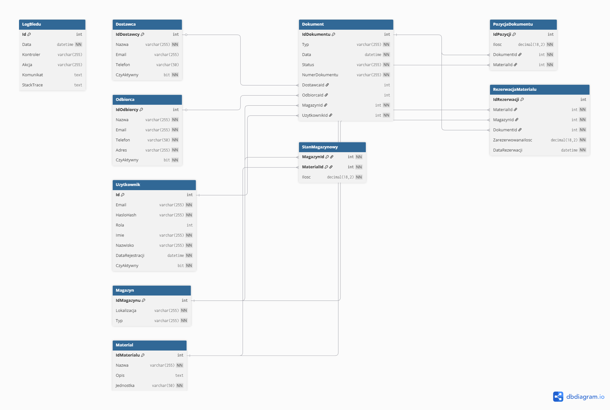
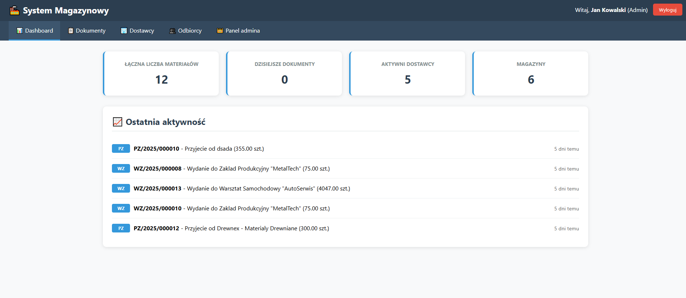
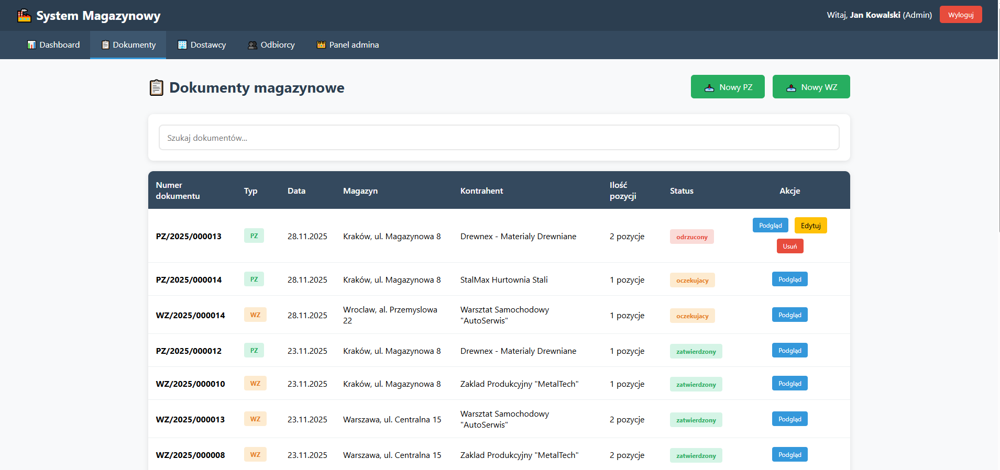
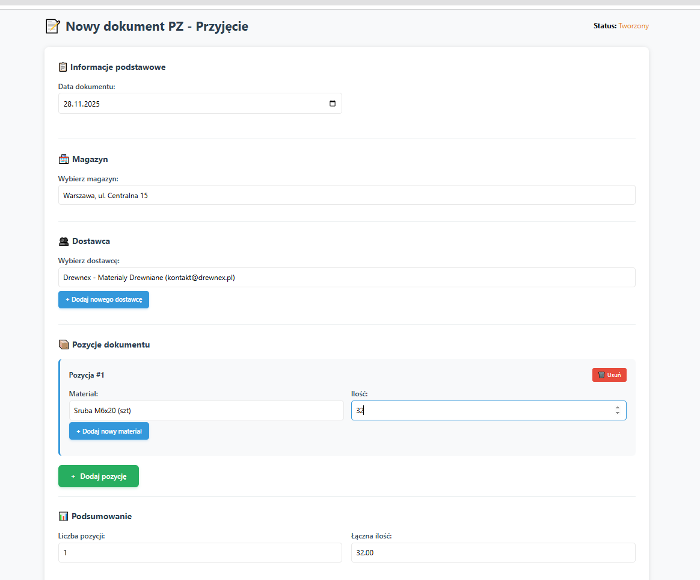
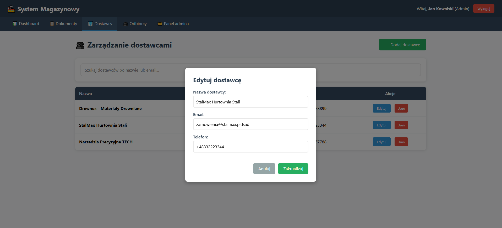
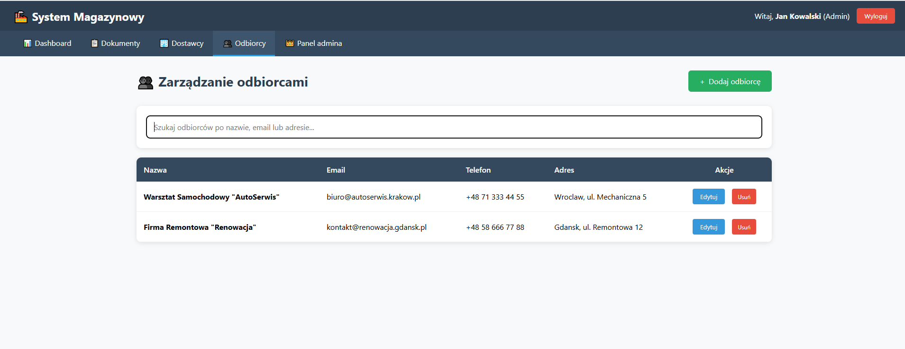
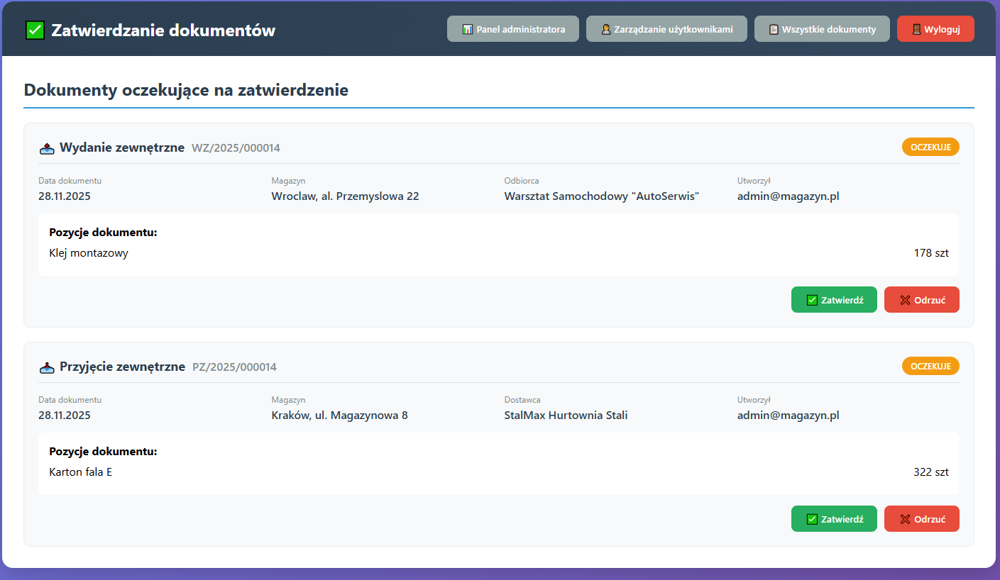
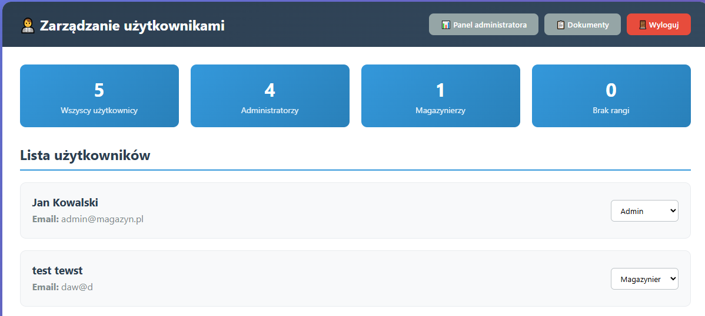

# System magazynowy – dokumentacja

## 1. Opis systemu

Celem projektu jest stworzenie oraz wdrożenie systemu informatycznego wspierającego kluczowe procesy magazynowe, takie jak obsługa dostaw, wydawanie materiałów, prowadzenie rezerwacji oraz zarządzanie stanami magazynowymi. System został zaprojektowany jako aplikacja webowa, umożliwiająca pracownikom magazynu i administracji wygodne, szybkie i bezpieczne zarządzanie dokumentacją logistyczną oraz bieżące monitorowanie zasobów.

### System zapewnia możliwość ewidencji:
- dostawców
- odbiorców
- materiałów
- dokumentów magazynowych
- aktualnych stanów magazynowych

### Obsługiwane procesy logistyczne:
- rejestrowanie i przyjmowanie dostaw
- wydawanie materiałów
- zatwierdzanie dokumentów
- zarządzanie użytkownikami oraz ich uprawnieniami

### Role użytkowników w systemie

#### Administrator
- posiada pełny dostęp do wszystkich modułów
- zarządza użytkownikami i ich uprawnieniami
- zatwierdza dokumenty i nadzoruje poprawność danych

#### Magazynier
- tworzy i edytuje dokumenty magazynowe
- dodaje dostawców i odbiorców
- przegląda materiały oraz stany magazynowe
- realizuje operacje przyjęć i wydań

System stanowi nowoczesne narzędzie wspierające pracę magazynu, usprawniające obieg dokumentów i zapewniające przejrzystość operacji logistycznych.

---

## 2. Diagram ERD



---

## 3. Procedury i funkcje

### 3.1 Procedura składowana: `sp_SearchOdbiorcy`

**Parametry:**
- `@SearchQuery NVARCHAR(100)` - tekst do wyszukania w tabeli `Odbiorcy`

**Opis działania:**
Procedura wyszukuje aktywnych odbiorców w tabeli `Odbiorcy` po polach: Nazwa, Email, Telefon, Adres. Zwraca dopasowane wyniki posortowane alfabetycznie po nazwie.

**Kod procedury:**
```sql
CREATE OR ALTER PROCEDURE sp_SearchOdbiorcy
    @SearchQuery NVARCHAR(100)
AS
BEGIN
    SET NOCOUNT ON;

    DECLARE @SearchTerm NVARCHAR(102) = '%' + @SearchQuery + '%';

    SELECT 
        IdOdbiorcy,
        Nazwa,
        Email,
        Telefon,
        Adres,
        CzyAktywny
    FROM Odbiorcy
    WHERE 
        (Nazwa LIKE @SearchTerm
        OR Email LIKE @SearchTerm
        OR Telefon LIKE @SearchTerm
        OR Adres LIKE @SearchTerm)
        AND CzyAktywny = 1
    ORDER BY Nazwa
END

```

### Procedura składowana: `sp_SearchDostawcy`

**Parametry:**
- `@SearchQuery NVARCHAR(100)` – tekst do wyszukania w tabeli `Dostawcy`

**Opis działania:**
Procedura wyszukuje aktywnych dostawców w tabeli `Dostawcy` po polach: Nazwa, Email, Telefon. Zwraca dopasowane wyniki posortowane alfabetycznie po nazwie.

**Kod procedury:**
```sql
CREATE OR ALTER PROCEDURE sp_SearchDostawcy
    @SearchQuery NVARCHAR(100)
AS
BEGIN
    SET NOCOUNT ON;

    DECLARE @SearchTerm NVARCHAR(102) = '%' + @SearchQuery + '%';

    SELECT 
        IdDostawcy,
        Nazwa,
        Email,
        Telefon,
        CzyAktywny
    FROM Dostawcy
    WHERE 
        (Nazwa LIKE @SearchTerm
        OR Email LIKE @SearchTerm
        OR Telefon LIKE @SearchTerm)
        AND CzyAktywny = 1
    ORDER BY Nazwa
END

```

### Funkcja: `dbo.PobierzStatystykiDashboard`

**Parametry:**
- `@DataDzisiaj DATE` – data, dla której mają być pobrane statystyki dokumentów

**Opis działania:**
Funkcja zwraca statystyki systemu w formie tabeli:
- liczba wszystkich materiałów (`LiczbaMaterialow`)
- liczba dokumentów z wybranego dnia (`DzisiejszeDokumenty`)
- liczba aktywnych dostawców (`AktywniDostawcy`)
- liczba magazynów (`LiczbaMagazynow`)

**Kod funkcji:**
```sql
CREATE FUNCTION dbo.PobierzStatystykiDashboard
(
    @DataDzisiaj DATE
)
RETURNS TABLE
AS
RETURN
(
    SELECT 
        (SELECT COUNT(*) FROM Materialy) AS LiczbaMaterialow,
        (SELECT COUNT(*) FROM Dokumenty WHERE CAST(Data AS DATE) = @DataDzisiaj) AS DzisiejszeDokumenty,
        (SELECT COUNT(*) FROM Dostawcy WHERE CzyAktywny = 1) AS AktywniDostawcy,
        (SELECT COUNT(*) FROM Magazyny) AS LiczbaMagazynow
);

```

### Funkcja: `dbo.PobierzOstatniaAktywnosc`

**Parametry:**
- `@LiczbaRekordow INT` – liczba ostatnich rekordów do pobrania

**Opis działania:**
Funkcja zwraca ostatnie aktywności w systemie (dokumenty PZ/WZ) wraz z opisem i sumą ilości materiałów. Wyniki są posortowane od najnowszych, ograniczone do podanej liczby rekordów.

**Kod funkcji:**
```sql
CREATE OR ALTER FUNCTION dbo.PobierzOstatniaAktywnosc
(
    @LiczbaRekordow INT
)
RETURNS TABLE
AS
RETURN
(
    SELECT 
        d.Typ,
        d.NumerDokumentu AS Numer,
        CASE
            WHEN d.Typ = 'PZ' THEN
                'Przyjęcie od ' + ISNULL(ds.Nazwa, '') + ' (' + CAST((SELECT SUM(Ilosc) FROM PozycjeDokumentow WHERE DokumentId = d.IdDokumentu) AS VARCHAR) + ' szt.)'
            WHEN d.Typ = 'WZ' THEN
                'Wydanie do ' + ISNULL(od.Nazwa, '') + ' (' + CAST((SELECT SUM(Ilosc) FROM PozycjeDokumentow WHERE DokumentId = d.IdDokumentu) AS VARCHAR) + ' szt.)'
            ELSE d.Typ + ' - ' + d.NumerDokumentu
        END AS Opis,
        d.Data AS Czas
    FROM Dokumenty d
    LEFT JOIN Dostawcy ds ON d.DostawcaId = ds.IdDostawcy
    LEFT JOIN Odbiorcy od ON d.OdbiorcaId = od.IdOdbiorcy
    ORDER BY d.Data DESC
    OFFSET 0 ROWS FETCH NEXT @LiczbaRekordow ROWS ONLY
);
```

### Trigger: `RezerwacjaPoDodaniu`

**Parametry:**  
- brak

**Opis działania:**  
Trigger uruchamia się po dodaniu lub usunięciu rezerwacji w tabeli `RezerwacjeMaterialow`. Aktualizuje stany magazynowe, zmniejszając dostępne ilości materiałów w magazynie zgodnie z wartością rezerwacji.

**Kod triggera:**
```sql
CREATE TRIGGER RezerwacjaPoDodaniu
ON RezerwacjeMaterialow
AFTER INSERT, DELETE
AS
BEGIN
    SET NOCOUNT ON;

    -- Wstawienie rezerwacji - zmniejszamy dostępne ilości
    UPDATE sm
    SET sm.Ilosc = sm.Ilosc - i.ZarezerwowanaIlosc
    FROM StanyMagazynowe sm
    INNER JOIN inserted i ON sm.MagazynId = i.MagazynId AND sm.MaterialId = i.MaterialId;
END
```


### Trigger: `DokumentPoOdrzuceniu`

**Parametry:**  
- brak

**Opis działania:**  
Trigger uruchamia się po aktualizacji tabeli `Dokumenty`.  
Działa tylko dla dokumentów WZ, które zmieniły status na **odrzucony**.  
Trigger:  
- przywraca stany magazynowe dla powiązanych materiałów  
- usuwa powiązane rezerwacje

**Kod triggera:**
```sql
CREATE TRIGGER DokumentPoOdrzuceniu
ON Dokumenty
AFTER UPDATE
AS
BEGIN
    SET NOCOUNT ON;

    -- Dokumenty WZ, które zmieniły status na odrzucony
    -- Przywracamy ilości w magazynie przed usunięciem rezerwacji
    UPDATE sm
    SET sm.Ilosc = sm.Ilosc + rm.ZarezerwowanaIlosc
    FROM StanyMagazynowe sm
    INNER JOIN RezerwacjeMaterialow rm ON sm.MagazynId = rm.MagazynId AND sm.MaterialId = rm.MaterialId
    INNER JOIN inserted i ON rm.DokumentId = i.IdDokumentu
    INNER JOIN deleted d ON i.IdDokumentu = d.IdDokumentu
    WHERE i.Status = 'odrzucony' AND d.Status <> 'odrzucony' AND i.Typ = 'WZ';

    -- Usuwamy rezerwacje dla odrzuconego WZ
    DELETE rm
    FROM RezerwacjeMaterialow rm
    INNER JOIN inserted i ON rm.DokumentId = i.IdDokumentu
    INNER JOIN deleted d ON i.IdDokumentu = d.IdDokumentu
    WHERE i.Status = 'odrzucony' AND d.Status <> 'odrzucony' AND i.Typ = 'WZ';
END


```

### Trigger: `DokumentPoAkceptacji`

**Parametry:**  
- brak

**Opis działania:**  
Trigger uruchamia się po aktualizacji tabeli `Dokumenty`.  
Działa tylko dla dokumentów, które zmieniły status na **zatwierdzony**:  
- dla dokumentów PZ – dodaje ilości materiałów do magazynu,  
- dla dokumentów WZ – usuwa powiązane rezerwacje.  

**Kod triggera:**
```sql
CREATE TRIGGER DokumentPoAkceptacji
ON Dokumenty
AFTER UPDATE
AS
BEGIN
    SET NOCOUNT ON;

    -- Dokumenty, które zmieniły status na zatwierdzony
    -- CTE, które wyłapuje dokumenty zmieniające status na 'zatwierdzony'
    WITH Zatwierdzone AS (
        SELECT i.IdDokumentu, i.Typ, i.MagazynId
        FROM inserted i
        INNER JOIN deleted d ON i.IdDokumentu = d.IdDokumentu
        WHERE i.Status = 'zatwierdzony' AND d.Status <> 'zatwierdzony'
    )
    -- PZ - dodajemy do magazynu
    MERGE StanyMagazynowe AS target
    USING (
        SELECT i.MagazynId, p.MaterialId, p.Ilosc
        FROM inserted i
        INNER JOIN deleted d ON i.IdDokumentu = d.IdDokumentu
        INNER JOIN PozycjeDokumentow p ON p.DokumentId = i.IdDokumentu
        WHERE i.Status = 'zatwierdzony' AND d.Status <> 'zatwierdzony' AND i.Typ = 'PZ'
    ) AS source (MagazynId, MaterialId, Ilosc)
    ON target.MagazynId = source.MagazynId AND target.MaterialId = source.MaterialId
    WHEN MATCHED THEN
        UPDATE SET target.Ilosc = target.Ilosc + source.Ilosc
    WHEN NOT MATCHED THEN
        INSERT (MagazynId, MaterialId, Ilosc)
        VALUES (source.MagazynId, source.MaterialId, source.Ilosc);

    -- WZ - usuwamy powiązane rezerwacje
    WITH Zatwierdzone AS (
        SELECT i.IdDokumentu, i.Typ, i.MagazynId
        FROM inserted i
        INNER JOIN deleted d ON i.IdDokumentu = d.IdDokumentu
        WHERE i.Status = 'zatwierdzony' AND d.Status <> 'zatwierdzony'
    )
    DELETE rm
    FROM RezerwacjeMaterialow rm
    INNER JOIN Zatwierdzone z ON rm.DokumentId = z.IdDokumentu
    WHERE z.Typ = 'WZ';

END

```

## 4. Zrzuty ekranu


### Ekran logowania


### Dashboard


### Lista dokumentów


### Dodawanie dokumentu


### Podgląd dostawców


### Podgląd odbiorcow


### Zatwierdzanie dokumentów


### Zarządzanie uzytkownikami



## 5.Instrukcja uruchomienia projektu
## Sklonowanie repozytoriu

```bash
git clone https://github.com/twoje-repozytorium/nazwa-projektu.git
cd nazwa-projektu

```
### Uruchomienie backendu
```bash
cd backend
dotnet ef database update
dotnet run

```
### Uruchomienie frontendu
```bash
cd fronend
npm install
npm start

```


### Uruchomienie testow
```bash
cd SystemMagazynuTests
dotnet test

```
